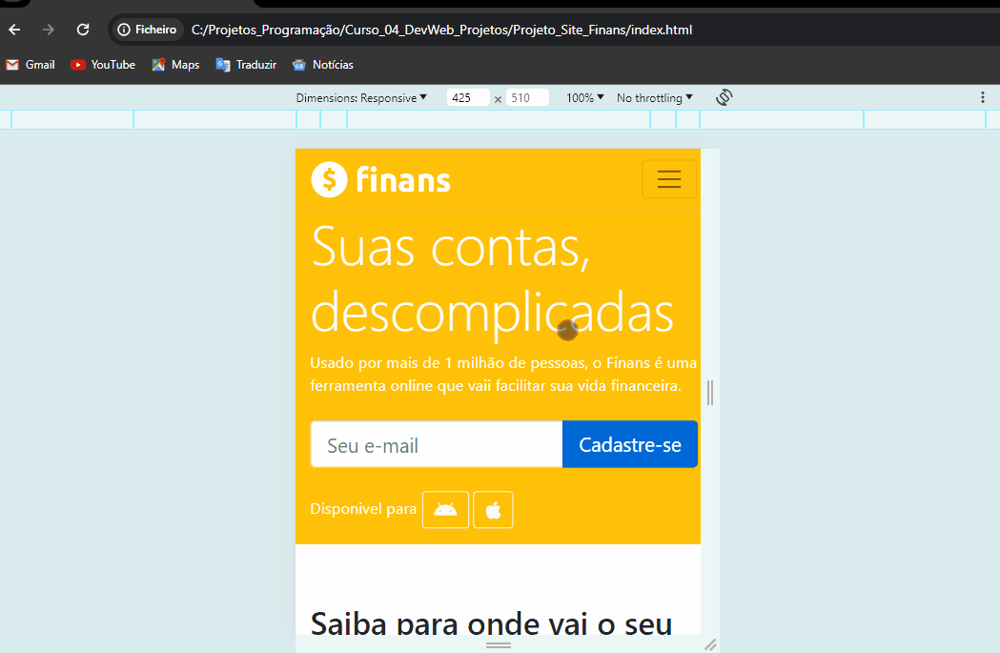

# Finans 

Finans é um site para uma aplicação financeira que permite aos usuários controlar suas finanças. O foco foi o desenvolvimento de um projeto responsivo.

## Recursos Principais

- Interface responsiva, adaptável a diferentes tamanhos de tela e dispositivos
- Interface simplificada e amigável para facilitar a navegação e utilização do site.

## Tecnologias/Framework Utilizadas

Este projeto utiliza as seguintes tecnologias:

HTML: Utilizado para a estruturação do conteúdo do site.
CSS: Utilizado para estilização e design da interface do usuário.
Bootstrap: Utilizado para estilização, design e responsividade da interface.

## Instalação

1. Clone este repositório: `https://github.com/https-ailton-dev/WebSite_HTML-CSS3-Bootstrap-Finans.git` ou `git@github.com:https-ailton-dev/WebSite_HTML-CSS3-Bootstrap-Finans.git`
2. Navegue até o diretório do projeto.

## Como Usar

1. Execute o código no navegador de sua escolha.
2. Navegue pelas diferentes páginas dedicadas de cada modelo.
3. Explore cada funcionalidade oferecida.

# Navegação
1. Navegação PC

2. Navegação Mobile

